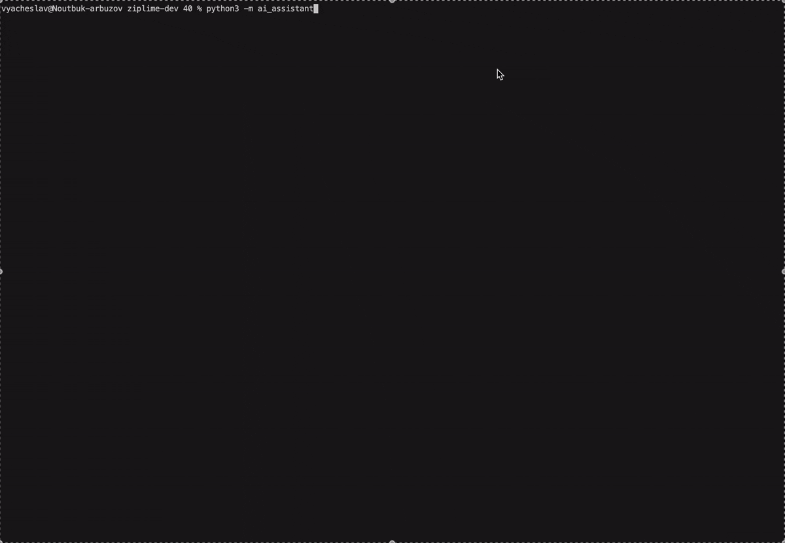

<p align="center">
  
  
</p>

<h1 align="center">The backtesting engine built for AI agents</h1>

<p align="center">
  <b>Vibe-code trading strategies. Verify them like a quant. Trade them live.</b>
</p>

<p align="center">
  Zipline, rebuilt from scratch on Polars — with a native <b>MCP server</b>, so Claude, Cursor, Codex or any agent can research, backtest and deploy strategies on stocks, ETFs and futures.<br>
  One file for backtest and live. No glue code. No copy-paste.
</p>

<p align="center">
  <a href="https://pypi.python.org/pypi/ziplime"></a>
  <a href="https://pypi.python.org/pypi/ziplime"></a>
  <a href="https://pypi.python.org/pypi/ziplime"></a>
  <a href="https://github.com/Limex-com/ziplime"></a>
  <!-- TODO: add MCP badge once listed in a directory, e.g. https://img.shields.io/badge/MCP-server-8A2BE2 -->
</p>

<p align="center">
  <a href="#-connect-your-ai-in-30-seconds">Connect your AI</a> ·
  <a href="https://ziplime.limex.com">Try in browser</a> ·
  <a href="#-python-quick-start">Python quick start</a> ·
  <a href="https://limex-com.github.io/ziplime/">Docs</a> ·
  <a href="#-community">Community</a>
</p>

<!-- TODO: replace with a 20–30s GIF of Claude/Cursor running the full loop through MCP: prompt → strategy → backtest → metrics → "deploy?" -->
<p align="center">
  
</p>

---

## Why this exists

LLMs write trading strategies in seconds. Most of them are wrong in ways that *look* right: lookahead bias, survivorship bias, fills that never happen, a Sharpe of 4 that evaporates on the first day of live trading.

And every tool makes **you** the glue: copy code out of the chat, fix imports, wrangle data, run, paste results back, repeat.

Ziplime flips it. **The agent proposes. The engine proves.**

Your AI gets a real backtester as a tool — point-in-time data, realistic execution, versioned results, a live-readiness check — and you get strategies that survived contact with reality instead of a chat transcript.

> Ziplime is not a wrapper around an LLM.
> It is a production-grade backtesting and live-trading engine that any LLM can drive.

---

## ⚡ Connect your AI in 30 seconds

Works with Claude Desktop, Claude Code, Cursor, Codex, Windsurf — anything that speaks MCP.

```json
{
  "mcpServers": {
    "ziplime": {
      "url": "https://ziplime.limex.com/mcp"
    }
  }
}
```
<!-- TODO: confirm the public MCP URL (/mcp vs /mcp-zipline/mcp) and whether first connect needs OAuth; if it does, add one line: "Sign in once, then the agent works on your behalf." -->

Then just talk to your agent:

> **You:** Backtest a 20/50 SMA crossover on NVDA for 2020–2025 and tell me if it beats buy-and-hold.
>
> **Agent:** *searches the ticker → writes the strategy → runs the backtest → pulls metrics → compares to benchmark*
>
> "CAGR 31% vs 68% for buy-and-hold, max drawdown 24% vs 66%. Lower return, much smoother ride. Want me to add a volatility filter and rerun?"

Prefer everything on your own machine?

```bash
pip install ziplime
ziplime mcp        # local MCP server over stdio — no account, no cloud
```
<!-- TODO: ship `ziplime mcp` (local stdio server over the engine) before publishing this block, or remove it. This is the single most important dev-facing feature for the launch. -->

---

## 🛠 What your agent can do

The MCP server exposes the whole quant workflow — not just "run backtest".

| Stage | Tools the agent gets |
| --- | --- |
| **Research** | `search_tickers` · `screen_market` · `analyze_signal` · `get_stock_factors` · `list_themes` |
| **Build** | `create_strategy` · `check_strategy_code` · `get_strategy_language_reference` · `copy_strategy` |
| **Test** | `run_backtest` · `get_backtest_metrics` · `get_backtest_trades` · `compare_backtests` · `compare_execution_costs` |
| **Ship** | `assess_live_readiness` · `prepare_deployment_plan` · `deploy_strategy_live` · `get_live_strategy_log` |

40+ tools. The agent can run the full loop on its own: **idea → screen → strategy → backtest → iterate → live** — and explain every step.

---

## 🍋 Zipline, rebuilt for 2026

Zipline was the gold standard of backtesting — until it was abandoned on pandas 0.x and Python 3.6. Dozens of forks patched it. None rebuilt it.

Ziplime keeps the API you know and replaces everything underneath:

- **Polars instead of pandas/NumPy** — Parquet-native, 2–5× faster, screaming on Apple Silicon
- **Full asyncio** — the engine is async end to end
- **Any frequency** — 1-minute, hourly, daily, weekly, monthly, or your own custom bars
- **OHLCV + point-in-time fundamentals** — P/E, revenue, margins, earnings, as they were known *at the time*
- **Python 3.12+**, modern packaging, active releases

```
Benchmark: 5 years daily data, 500 assets, SMA crossover strategy

Ziplime (Polars)  ████████░░░░░░░░░░░░░░░░░░  12.4s
Zipline (pandas)  █████████████████████████░  38.7s
Backtrader        ████████████████████████████ 52.1s
```
*Apple Silicon M3, Python 3.12. Reproduce it: `python benchmarks/sma_500.py`*
<!-- TODO: add the benchmarks/ folder with the script. An unreproducible benchmark is a liability on HN. Consider adding zipline-reloaded and vectorbt rows. -->

---

## 📈 Stocks, ETFs, futures — one portfolio, one file

- **Equities & ETFs** — US markets out of the box
- **Futures** — contract specs, multipliers, roll handling <!-- TODO: verify exact futures support wording (continuous contracts? roll rules?) -->
- **Mixed portfolios** — hold SPY, ES and a basket of single names in the same algorithm
- **Multiple data sources:**

| Source | Type | Cost |
| --- | --- | --- |
| Yahoo Finance | Historical OHLCV | Free |
| CSV files | Any custom data | Free |
| Lime Trader SDK | Real-time & historical | Broker account |
| LimexHub | Professional-grade data + fundamentals | Subscription |

<!-- TODO: if crypto / forex are supported, add them here; if not, don't. -->

---

## 🔴 Backtest → live in zero lines

The same algorithm file. The same logic. Just change the mode.

```bash
# Backtest
python -m ziplime run -f my_strategy.py --start-date 2023-01-01 --end-date 2023-12-31

# Live (via Lime Trader SDK)
python -m ziplime run -f my_strategy.py --mode live
```

No adapter classes. No "paper trading wrapper." No rewrite.
**Your backtest *is* your live strategy** — and your agent can deploy it (`deploy_strategy_live`) after `assess_live_readiness` says it's safe.

---

## 🐍 Python quick start

```bash
pip install ziplime
```

```python
# my_strategy.py
from ziplime.finance.execution import MarketOrder

async def initialize(context):
    context.asset = await context.symbol("AAPL")
    context.invested = False

async def handle_data(context, data):
    if not context.invested:
        await context.order_target_percent(
            asset=context.asset, target=1.0, style=MarketOrder()
        )
        context.invested = True
```

```python
import asyncio, datetime
from ziplime.core.run_simulation import run_simulation

asyncio.run(run_simulation(
    algorithm_file="my_strategy.py",
    start_date=datetime.datetime(2023, 1, 1, tzinfo=datetime.timezone.utc),
    end_date=datetime.datetime(2023, 12, 31, tzinfo=datetime.timezone.utc),
    total_cash=100_000,
    trading_calendar="NYSE",
))
```

Coming from Zipline? Most algorithms port by adding `async`/`await`. See the [migration guide](https://limex-com.github.io/ziplime/). <!-- TODO: write the migration guide page; this is the #1 question from zipline-reloaded users -->

---

## 🧭 Pick your door

| You are… | Start here |
| --- | --- |
| A trader who doesn't want to code | **[ziplime.limex.com](https://ziplime.limex.com)** — chat, backtest, deploy in the browser. Nothing to install. |
| A quant or Python developer | `pip install ziplime` — the engine, local, yours. |
| Building agents or AI products | **[MCP server](#-connect-your-ai-in-30-seconds)** — give your agent a real backtester in one config line. |

---

## ⚔️ How it compares

<!-- TODO: verify EVERY cell before publishing. A wrong competitor claim is the fastest way to get roasted. -->

| | **Ziplime** | zipline-reloaded | backtrader | vectorbt | nautilus_trader |
| --- | :---: | :---: | :---: | :---: | :---: |
| Native MCP server (agent-driven) | ✅ | — | — | — | — |
| Data engine | Polars / Parquet | pandas / HDF5 | pandas | NumPy / Numba | Rust |
| Live trading built in | ✅ | — | ✅ | — | ✅ |
| Same file: backtest → live | ✅ | — | ✅ | — | ✅ |
| Futures | ✅ | partial | ✅ | — | ✅ |
| Point-in-time fundamentals | ✅ | — | — | — | — |
| Hosted, no-install version | ✅ | — | — | — | — |
| Actively maintained | ✅ | ✅ | ⚠️ | ✅ | ✅ |

---

## 🤝 Community

- ⭐ **Star the repo** — it's how new people find us
- 💬 [Discord](#) / [Telegram](#) <!-- TODO: pick one, create it, link it -->
- 📖 [Documentation](https://limex-com.github.io/ziplime/)
- 🐛 [Issues](https://github.com/Limex-com/ziplime/issues) · [Good first issues](https://github.com/Limex-com/ziplime/labels/good%20first%20issue)
- 🏠 Built by [Limex](https://limex.com)

<p align="center">
  <a href="https://star-history.com/#Limex-com/ziplime&Date">
    
  </a>
</p>

---

## License

<!-- TODO: resolve GPL-3.0 vs END_USER_LICENSE_AGREEMENT before the promo push. Cleanest story: engine = Apache-2.0 or GPL-3.0 (pick one, remove the EULA from the repo); hosted platform terms live on the website, not in the repo. -->
Ziplime engine is open source under GPL-3.0. The hosted platform at ziplime.limex.com has its own [terms](https://ziplime.limex.com/terms).

---

<p align="center"><i>Zipline is dead. Long live Ziplime.</i> 🍋</p>
