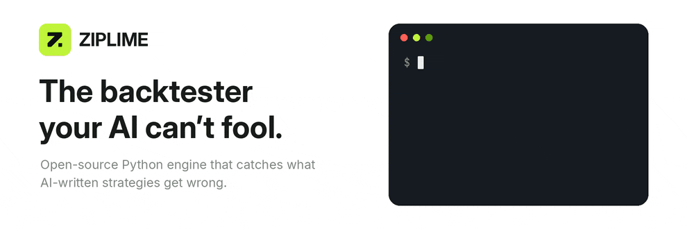

<p align="center">
  <!-- TODO: dev has no ai_assistant/ folder, so the old logo paths 404. Either restore
       img/logo_black.png + img/logo_white.png for dark/light, or keep the single logo below. -->
  <picture>
    <source media="(prefers-color-scheme: dark)" srcset="img/ziplime-mcp-demo-dark.gif">
    <source media="(prefers-color-scheme: light)" srcset="img/ziplime-mcp-demo-light.gif">
    
  </picture>
</p>

<h1 align="center">The backtester your AI can't fool.</h1>

<p align="center">
  <b>Ziplime is an open-source Python backtesting engine built to catch what AI-written strategies get wrong:<br>
  look-ahead, fills that never happened, costs that quietly disappear.</b><br><br>
  Claude Code or Codex will write you a strategy in a minute, and it will sound convincing either way.<br>
  Ziplime checks whether the backtest behind it is honest.
</p>

<p align="center">
  <a href="https://pypi.python.org/pypi/ziplime"></a>
  <a href="#license"></a>
  <a href="https://pypi.python.org/pypi/ziplime"></a>
  <a href="https://pypi.python.org/pypi/ziplime"></a>
  <a href="https://github.com/Limex-com/ziplime"></a>
</p>

<p align="center">
  <a href="#engine">What the engine checks</a> ·
  <a href="#quick-start">Quick start</a> ·
  <a href="#with-your-ai">Use it with your AI</a> ·
  <a href="#compare">How it compares</a> ·
  <a href="#license">License</a> ·
  <a href="https://limex-com.github.io/ziplime/">Docs</a>
</p>

<p align="center">
  next-bar fills by default · look-ahead checks on vectorized signals · point-in-time data · Zipline-style API ·
  works inside Claude Code, Codex and Cursor · AGPL-3.0, your strategies stay yours
</p>

<!-- TODO: record a 20–30s GIF of the core story: an AI-written strategy with a look-ahead bug
     → Ziplime stops the run and names the bar → the fixed version runs.
     Until it exists, leave no  here — a broken image on the first screen costs more than no image. -->

---

## Why this exists

AI made writing a trading strategy free. It didn't make knowing whether the strategy is true any cheaper.

A model will write you a backtester, an HFT algorithm, a factor model — fluently, with nice charts. If you don't know the field well, you can't tell which parts are nonsense, and asking the same model doesn't help: it wrote them.

Ziplime is the second opinion that can't be talked round. The model can be confident; the engine is strict. It won't fill an order at a price that didn't exist yet, show a strategy a number before it was public, or quietly drop a cost it can't apply — and when it refuses, it says where and why.

> The AI proposes. The engine checks. You decide.

---

<a id="engine"></a>
## 🛡 What the engine refuses to fake

Strict by default — the shortcuts that make backtests look good have to be asked for by name.

- **Next-bar fills.** An order fills on the bar after the decision. Filling at the close of the bar the decision was made on is an explicit flag (`--same-bar-execution`), never something a strategy inherits.
- **Vectorized signals are checked for causality.** `compute_signals` is recomputed on truncated history; a signal that used the future — a full-sample mean, a `shift(-1)` — stops the run before it starts:
  ```
  Signal 'momentum' looks ahead. At bar 240 (2024-03-15) the whole-history computation
  gives 1.0, but computing from the first 240 bars alone -- all that was known then --
  gives 2.0.
  ```
- **Intraday bars without look-ahead.** Vendor bars are placed on the simulation clock so no bar leaks into the one before it.
- **Point-in-time data by knowledge date.** Fundamentals, insider and congressional-trading datasets are windowed by when a row became public, not by the period it describes.
- **Costs are applied or refused, never dropped.** A cost model the vectorized kernel can't apply stops the run by name — unpaid costs don't show up as an error, they show up as a higher return.
- **No tool places an order on its own.** The local AI server has no order tool at all; on the hosted platform a live deployment is created paused and starts only when you say so.

What the engine can't check: whether your idea has an edge, whether your data source has survivorship bias (Yahoo's does — delisted stocks aren't there), whether you tuned twenty parameters on two hundred trades. That judgment is still yours.

**Found a way to sneak the future past the engine? That's a bug — [open an issue](https://github.com/Limex-com/ziplime/issues).**

---

<a id="quick-start"></a>
## 🐍 Quick start

```bash
pip install ziplime
ziplime ingest-assets                                   # once: the instrument list (Yahoo, no key)
ziplime ingest -b demo -s AAPL,MSFT --start-date 2019-01-01 --end-date 2025-12-31
```

```python
# sma.py
from ziplime.domain.bar_data import BarData
from ziplime.finance.execution import MarketOrder
from ziplime.trading.trading_algorithm import TradingAlgorithm


async def initialize(context: TradingAlgorithm):
    context.assets = [await context.symbol("AAPL"), await context.symbol("MSFT")]
    context.fast, context.slow = 20, 50


async def handle_data(context: TradingAlgorithm, data: BarData):
    for asset in context.assets:
        bars = await data.history(assets=[asset], fields=["close"], bar_count=context.slow)
        if len(bars) < context.slow:
            continue
        closes = bars["close"]
        target = 0.5 if closes[-context.fast:].mean() > closes.mean() else 0.0
        await context.order_target_percent(asset=asset, style=MarketOrder(), target=target)
```

```bash
ziplime run -f sma.py -b demo -s AAPL,MSFT --start-date 2020-01-01 --end-date 2025-12-31
```

**Coming from Zipline?** The shape is the same — `initialize`, `handle_data`, `order_target_percent`. Two things change: everything that touches the engine is `await`ed, and `data.history` returns a Polars frame, so `.iloc` / `.loc` become `bars["close"][-1]`. A missing `await` doesn't raise; it silently places no orders. See the [docs](https://limex-com.github.io/ziplime/).
<!-- TODO: a dedicated migration page is still the #1 thing zipline-reloaded users will look for. -->

---

<a id="with-your-ai"></a>
## 🤖 Use it with your AI

Whatever writes your strategies — Claude Code, Codex, Cursor — can call Ziplime directly through MCP, so the numbers come from the engine instead of from the model. Same checks, whoever wrote the code.

| | **Local** — `ziplime mcp` | **Hosted** — `ziplime.limex.com/mcp` |
| --- | --- | --- |
| Install | `pip install "ziplime[mcp]"` | nothing |
| Account | none | ZipLime account |
| Data | Yahoo Finance (free), point-in-time datasets on Hugging Face, your own CSVs | Professional US equity data with fundamentals and factors, from the Nasdaq-100 to every US listing |
| What the agent can do | ingest, write, check, backtest, compare | all of that, plus screening, factor analysis and relationship discovery |
| Live trading | from your terminal, never through a tool | readiness check → paused deployment → explicit start, via Lime |

**Local** — Claude Code:

```bash
pip install "ziplime[mcp]"
claude mcp add ziplime -- ziplime mcp
```

Claude Desktop, Cursor, Windsurf or any client that launches stdio servers:

```json
{ "mcpServers": { "ziplime": { "command": "ziplime", "args": ["mcp"] } } }
```

If you installed into a virtualenv, put the full path to its `ziplime` executable in `command` — desktop apps don't see your shell's `PATH`.

**Hosted** — Claude Code: `claude mcp add --transport http ziplime https://ziplime.limex.com/mcp`, or in any client:

```json
{ "mcpServers": { "ziplime": { "url": "https://ziplime.limex.com/mcp" } } }
```

<!-- TODO: confirm the first-connect sign-in flow and the free tier / backtest quota, one line each. -->

> **You:** Find S&P 500 names with rising margins near their 52-week high. Has that ever predicted returns? If it has, backtest it and tell me what it would cost to run.
>
> **Agent:** `screen_market` → `analyze_signal` → `create_strategy` → `check_strategy_code` → `run_backtest` → `get_backtest_metrics` → `compare_execution_costs` → `assess_live_readiness`
>
> …and reports the factor's information coefficient by horizon, the backtest and the real cost of its fills — then stops before anything goes live.

<a id="hosted-data"></a>
<details>
<summary><b>What the hosted server adds</b> — universes, fundamentals, factor research</summary>

| Universe | Covers | Instruments |
| --- | --- | ---: |
| `Q100US` | Nasdaq-100 | 96 |
| `Q500US` | S&P 500 | 455 |
| `Q1500US` | S&P 1500 Composite | 1,299 |
| `USALL` | every US equity with data | 3,197 |

Quantopian veterans will recognise the names.

- **Screening** — `screen_market` runs your condition across a universe with fundamentals and factor data alongside prices: balance sheet, income statement, cash flow, value, growth, profitability, momentum, short interest and more.
- **Factor analysis** — `analyze_signal` reports the information coefficient per horizon, returns by quantile, the top-minus-bottom spread and turnover. If you have used Alphalens, you know the shape.
- **Relationship discovery** — `discover_relationships` measures how market states described in words lined up with what happened next, holding part of the history back; `validate_relationship` tests the finding on the period it never saw.
- **Execution costs** — `compare_execution_costs` reprices a finished run's actual fills under different commission schedules without rerunning.
- **Path to live** — `assess_live_readiness` → `prepare_deployment_plan` → `create_live_deployment` (paused) → `start_live_deployment`, called only when you ask in so many words.

</details>

<details>
<summary><b>Tool reference</b> — 14 local tools, 40+ hosted</summary>

**Local** — `ziplime mcp`:

| Stage | Tools |
| --- | --- |
| **Data** | `list_data_providers` · `list_bundles` · `ingest_instruments` · `ingest_market_data` |
| **Build** | `get_strategy_language_reference` · `write_strategy` · `check_strategy_code` · `list_strategies` · `read_strategy` |
| **Test** | `run_backtest` · `list_backtests` · `get_backtest` · `compare_backtests` |
| **Live** | `describe_live_trading` — explains the route to live; places no orders |

**Hosted**, including:

| Stage | Tools |
| --- | --- |
| **Research** | `search_tickers` · `list_universes` · `list_themes` · `screen_market` · `analyze_signal` · `get_stock_factors` · `discover_relationships` · `validate_relationship` |
| **Build** | `create_strategy` · `update_strategy` · `copy_strategy` · `check_strategy_code` · `get_strategy_language_reference` |
| **Test** | `run_backtest` · `get_backtest_metrics` · `get_backtest_trades` · `compare_backtests` · `compare_execution_costs` · `promote_backtest` |
| **Ship** | `assess_live_readiness` · `prepare_deployment_plan` · `create_live_deployment` · `start_live_deployment` · `pause_live_deployment` · `get_live_deployment_activity` |

The two servers run the same engine under different code contracts. Locally a strategy is a normal Python module: imports, `before_trading_start`, `analyze` and a config class all work. The hosted server runs strategies in a sandbox without imports. Each server hands the agent its own rules through `get_strategy_language_reference`.

</details>

---

<a id="two-engines"></a>
## ⚡ Event-driven and vectorized, one ledger

An event-driven engine is right for strategies that read their own book — sizing off portfolio value, exposure caps, futures rolls. A vectorized engine is right for arithmetic and for sweeps. Ziplime has both, and both report through the same ledger, cost models and metrics, so the results are directly comparable.

The vectorized design is inspired by [vectorbt](https://github.com/polakowo/vectorbt) — credit where it's due. The kernel is Ziplime's own (`pip install "ziplime[numba]"` compiles its inner loop; without it the same loop runs interpreted), and vectorbt serves as a **reference oracle** in the test suite: [`tests/vectorized/reference/vectorbt`](tests/vectorized/reference/vectorbt) checks fills against it and asserts the deliberate differences instead of hiding them.

| | What is vectorized | Execution & costs | Futures / options | For |
| --- | --- | --- | --- | --- |
| **Signals inside a run** — `compute_signals` | the strategy's arithmetic | Ziplime's blotter, every cost model | ✅ | one strategy, faster |
| **Sweep, then report** — `simulate_signals` | the whole run | Ziplime's kernel and cost models | refused | hundreds of variants |

```python
WARMUP = 60                                   # sessions of history the indicators need

def compute_signals(context, prices):         # one pass over the whole history
    return {
        "fast": prices.close.rolling(20).mean(),
        "slow": prices.close.rolling(60).mean(),
    }

async def handle_data(context, data):         # bar by bar, as usual
    if not context.signals.is_ready("slow"):
        return
    ...                                       # sizing, caps, rolls stay here
```

`context.signals` is cut to the simulation clock — on bar `t` there is no accessor that returns row `t+1`. A sweep's winner is replayed through the ledger with reconciliation after every bar. From [`examples/vectorized`](examples/vectorized): 48 moving-average combinations swept in 0.2 s, winner replayed through the ledger; vectorizing a strategy's signals cut time spent in `handle_data` by 2.3×.

<!-- TODO: add a head-to-head with vectorbt only together with benchmarks/vs_vectorbt.py:
     same inputs, same costs, numba on for both, hardware stated. Suggested wording once it exists:
     "On <benchmark>, the kernel runs within 2× of vectorbt — while reconciling every bar through
     the same ledger an event-driven run uses." -->

---

## 📈 Asset classes and data

- **Equities & ETFs** — US markets out of the box
- **Futures** — dated contracts with multipliers, expirations and rolls; seven example strategies on real Yahoo futures chains in [`examples/futures`](examples/futures)
- **Options** — spreads, structures and 0DTE examples in [`examples/options`](examples/options)
- **Bonds** and **cross-asset portfolios** — [`examples/cross_asset`](examples/cross_asset)

| Source | What | Cost |
| --- | --- | --- |
| Yahoo Finance | Historical OHLCV, futures chains | Free |
| Hugging Face Hub | Point-in-time fundamentals, insider trades, congressional trades, earnings calendar — mounted straight into `data.history`, no ingest (`pip install "ziplime[huggingface]"`) | Free |
| CSV | Your own data | Free |
| [Hosted server](#hosted-data) | US universes up to 3,197 equities with fundamentals and factors, plus research tools | ZipLime account |
| Lime Trader SDK | Real-time & historical | Broker account |
| LimexHub | Professional-grade market data and fundamentals for local runs | Subscription |

---

## 🔴 Backtest → live

Execution sits behind one interface. A backtest uses `SimulationExchange`; live trading swaps in `LimeTraderSdkExchange` and runs **the same strategy file** — see [`examples/run_live_trading.py`](examples/run_live_trading.py) (credentials via `LIME_SDK_CREDENTIALS_FILE`). Lime is the reference adapter; another broker means subclassing the same exchange interface.

Live trading is never exposed as a local MCP tool: a tool that submits real orders is one misunderstanding away from a model using it.

---

## 🍋 Zipline, rebuilt

Zipline set the standard for Python backtesting and then stalled on old pandas and old Python. Ziplime started as a fork of it — the git history says so — and most of the engine has since been rewritten. The files that still carry Zipline code keep Quantopian's copyright and Apache 2.0 notice (see [NOTICE](NOTICE)).

What Ziplime kept is the programming model. What it replaced: Polars and Parquet in the data layer instead of pandas/NumPy and bcolz, asyncio end to end, any bar size from 1 second to 1 month, a vectorized kernel next to the event-driven engine, and Python 3.12+.

<!-- TODO: publish engine timing numbers only together with benchmarks/sma_500.py in the repo. -->

---

## 🧭 Pick your door

| You are… | Start here |
| --- | --- |
| Writing strategies with Claude Code or Codex | [Connect Ziplime](#with-your-ai) so your agent backtests for real. |
| A quant or Python developer | `pip install ziplime` — the engine, local, yours. |
| Researching factors on real universes | [The hosted server](#hosted-data) — S&P 1500 data, screening and factor analysis without a data pipeline. |
| A trader who doesn't want to code | **[ziplime.limex.com](https://ziplime.limex.com)** — chat, backtest, deploy in the browser. |
| Building a product for your own clients | Ziplime is AGPL-3.0; for a closed product, see the [commercial license](#license). |

---

<a id="compare"></a>
## ⚔️ How it compares

As of October 2026. Something wrong or out of date? [Open an issue](https://github.com/Limex-com/ziplime/issues) and we'll fix the table.

| | **Ziplime** | QuantConnect LEAN | zipline-reloaded | NautilusTrader | backtrader | vectorbt |
| --- | :---: | :---: | :---: | :---: | :---: | :---: |
| Engine core | Python · Polars | C# · Python API | Python · pandas | Rust · Python API | Python | NumPy/Numba |
| Simulation | event-driven + vectorized | event-driven | event-driven | event-driven | event-driven | vectorized |
| Zipline-style API | ✅ (async) | — | ✅ | — | — | — |
| Futures | ✅ | ✅ | ✅ | ✅ | ✅ | PRO only¹ |
| Options | ✅ | ✅ | — | ✅ | — | — |
| Built-in fundamental / alt data | ✅ free PIT datasets + hosted² | ✅ QC Data Library | — | — | — | — |
| Live trading | ✅ Lime³ | ✅ many brokers | — | ✅ many venues | ✅ IB, Oanda | — |
| Hosted, no-install version | ✅ | ✅ | — | — | — | — |
| Official MCP server | ✅ local + hosted | ✅ cloud⁴ | — | — | — | — |
| License | AGPL-3.0⁵ | Apache-2.0 | Apache-2.0 | LGPL-3.0 | GPL-3.0 | Apache-2.0 + Commons Clause |
| Actively maintained⁶ | ✅ | ✅ | ⚠️ | ✅ | ❌ | ✅ |

¹ Contract multipliers for futures are a VectorBT PRO feature.
² Free: fundamentals, insider, congressional-trading and earnings-calendar datasets on the Hugging Face Hub, windowed by knowledge date. Hosted: US universes with fundamentals and factors.
³ Lime is the built-in adapter; other brokers plug in by subclassing one exchange interface.
⁴ QuantConnect's MCP server drives the QuantConnect cloud API and needs a QuantConnect account. Ziplime's local server runs on your own machine with no account.
⁵ With an additional permission that keeps your strategies outside the AGPL, and a commercial license for closed products. See [License](#license).
⁶ Latest PyPI releases: zipline-reloaded July 2025, backtrader April 2023; the others released within the last two months.

<!-- TODO: recheck every cell right before publishing; the dates go stale first. -->

---

## 🤝 Community

- 💬 [GitHub Discussions](https://github.com/Limex-com/ziplime/discussions) — questions and ideas
- ⭐ **Star the repo** — it's how new people find us
- 📖 [Documentation](https://limex-com.github.io/ziplime/)
- 🐛 [Issues](https://github.com/Limex-com/ziplime/issues) · [Good first issues](https://github.com/Limex-com/ziplime/labels/good%20first%20issue)
- 🏠 Built by [Limex](https://limex.com)

Nothing in Ziplime or its docs is investment advice.

---

<a id="license"></a>
## ⚖️ License

<!-- TODO before publishing — commit together with this README:
     LICENSE             AGPL-3.0 text from gnu.org (replaces GPL-3.0)
     LICENSE-EXCEPTION.md  the additional permission for strategies
     NOTICE              Zipline / Quantopian attribution, Apache 2.0
     remove END_USER_LICENSE_AGREEMENT (platform terms go on the website)
     pyproject.toml: license = "AGPL-3.0-only"
     enable CLA Assistant on the repo; fill in the licensing contact below -->

Ziplime is open source under the [GNU AGPL v3](LICENSE), with an [additional permission](LICENSE-EXCEPTION.md) for your strategies.

**Do I have to publish my strategies?**
No. Strategies, signal code, configuration and data that use Ziplime through its strategy interface — `initialize`, `handle_data`, `compute_signals` and the rest — are yours, under any terms you choose. Your alpha stays yours.

**Can a fund or a prop desk use Ziplime internally?**
Yes. Running Ziplime, modified or not, for your own research and trading puts you under no obligation to publish anything. Obligations begin only when you distribute Ziplime, or offer a modified version of it to outside users over a network.

**Building a product or a service for clients on top of Ziplime?**
Either make the source of your modified Ziplime available to its users under AGPL-3.0, or get a commercial license. The commercial license is also the answer if your company's policy doesn't allow AGPL. Write to us: <!-- TODO: licensing contact (email or form) -->

**Contributing.**
Pull requests are accepted under a Contributor License Agreement, which is what lets the commercial license exist. A bot walks you through it on your first PR.

**Earlier code.**
Everything published before the switch, including releases up to 1.19.x, remains available under GPL-3.0.

The hosted platform at ziplime.limex.com is covered by its own terms of service. <!-- TODO: link them -->

---

<p align="center"><i>The AI proposes. The engine checks. You decide.</i> 🍋</p>
